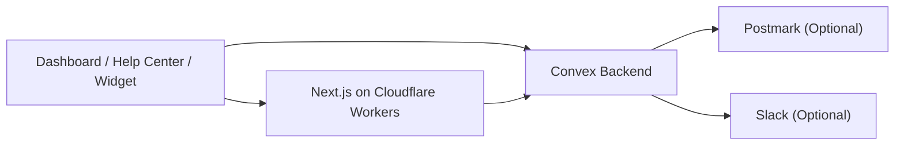

# Open Helpdesk

> Open-source support desk on Convex + Cloudflare Workers.

Open Helpdesk gives you a self-hosted support inbox, public help center, product updates feed, and embeddable widget in one repo. It is designed to boot from a fresh install with a first-owner setup flow, and it keeps Postmark and Slack optional so a basic deployment stays simple.

[](https://deploy.workers.cloudflare.com/?url=https://github.com/jamesdevonport/open-helpdesk)

Cloudflare’s official deploy-button format is documented [here](https://developers.cloudflare.com/workers/platform/deploy-buttons/). Their docs also note that deploy buttons do not fully support monorepos yet, so if the one-click import does not infer the project correctly, use the manual setup steps below.

## What You Get

- Password-based first-owner bootstrap at `/setup`
- Shared dashboard, help center, and widget deployment
- Public help articles and product updates
- Embeddable `window.OpenHelpdesk` widget with `siteUrl` support
- Convex backend with optional Postmark email replies and optional Slack routing
- Cloudflare Workers deployment path via OpenNext

## Architecture



## Fastest Install

1. Create a blank Convex project at [dashboard.convex.dev](https://dashboard.convex.dev).
2. Open the production deployment and copy its deployment URL. Convex shows this on `Deployment Settings` > `URL and Deploy Key`, and it looks like `https://your-project.convex.cloud`.
3. Click the Deploy to Cloudflare button above and paste that URL as `NEXT_PUBLIC_CONVEX_URL`.
4. When the Cloudflare deploy finishes, deploy the backend once with `npx convex deploy --yes` against the same Convex project.
5. Open `/setup` on the deployed app and create the first owner.

You do not need to seed the database first. A blank Convex project is the intended starting point, and `/setup` creates the first workspace and admin account.

## Quickstart

Install dependencies:

```bash
npm install
```

Start Convex in one terminal:

```bash
npm run dev:convex
```

The first time you run that command, Convex will prompt you to log in, create or reconnect a project, and write the local deployment settings into `.env.local`.

Start the app in another terminal:

```bash
npm run dev
```

Then open [http://localhost:3000/setup](http://localhost:3000/setup), create the first owner account, and finish workspace bootstrap.

## Setup Process

### 1. Create a blank Convex project

1. Open the Convex dashboard at [dashboard.convex.dev](https://dashboard.convex.dev).
2. Click `Create Project`.
3. Convex will create a project with a production deployment and development deployments.
4. Leave the database blank. Open Helpdesk bootstraps itself from the UI.

### 2. Get the Convex values you need

For the Cloudflare deploy button, the value you need is your production deployment URL.

1. In Convex, open the production deployment for your project.
2. Go to `Deployment Settings` > `URL and Deploy Key`.
3. Copy the deployment URL that looks like `https://your-project.convex.cloud`.
4. Use that value as `NEXT_PUBLIC_CONVEX_URL` in Cloudflare.

Optional advanced automation:

1. On the same page, click `Generate Production Deploy Key`.
2. Copy the key and keep it safe.
3. Use `CONVEX_DEPLOY_KEY` only in CI or local automation when you want `npx convex deploy` to run non-interactively and inject the URL during the build.

### 3. Deploy on Cloudflare

1. Click the Deploy to Cloudflare button above.
2. Paste your Convex production deployment URL as `NEXT_PUBLIC_CONVEX_URL`.
3. Optionally set `SITE_URL` if you already know the final custom domain.
4. Optionally set `HELP_CENTER_HOST` if you want docs on a separate hostname.
5. Leave Postmark and Slack fields empty unless you are enabling those integrations now.

This repo's Cloudflare deploy command will build the dashboard and widget, then deploy the Worker with `wrangler deploy`. The deployed Worker reads `NEXT_PUBLIC_CONVEX_URL` from the Worker runtime binding you set in Cloudflare.

### 4. Deploy the Convex backend once

The Cloudflare deploy button does not push your Convex functions for you. After the Worker deploy finishes:

1. Clone the repository locally if you have not already.
2. Run `npm install`.
3. Connect the Convex CLI to the same project.
4. Run `npx convex deploy --yes`.

That publishes the Open Helpdesk functions and schema to the blank production deployment behind your `NEXT_PUBLIC_CONVEX_URL`.

### 5. Boot the workspace

1. Open the deployed app URL.
2. Go to `/setup`.
3. Create the first owner account with email + password.
4. Enter the workspace name and complete bootstrap.

After that:

- `/setup` is effectively closed
- normal dashboard sign-in uses email + password
- additional team members should be added from the dashboard, not by reopening bootstrap

### 6. Optional keys

You do not need these for the basic product to work.

Optional Postmark keys:

- `POSTMARK_SERVER_TOKEN`
- `POSTMARK_INBOUND_ADDRESS`
- `POSTMARK_WEBHOOK_SECRET`
- `DEFAULT_FROM_EMAIL`
- `INBOUND_ORG_ID`

Optional Slack keys:

- `SLACK_BOT_TOKEN`
- `SLACK_CHANNEL_ID`
- `SLACK_SIGNING_SECRET`

### 7. Where keys live

- Local development: `.env.local`
- Cloudflare production runtime: Worker environment variables / secrets
- Convex production runtime: Convex environment variables
- GitHub Actions: repository secrets / variables if you use the included workflows

## Deploy With AI

The repo is set up so an agent can operate from the root without guessing workspace paths.

```bash
npm install
export NEXT_PUBLIC_CONVEX_URL=https://your-project.convex.cloud
npm run deploy:cloudflare
```

Expected checkpoints:

- `npm run build:cloudflare` builds the widget and Worker bundle
- `wrangler deploy` uploads the Worker
- the deployed app reads `NEXT_PUBLIC_CONVEX_URL` from the Worker runtime binding

If you want CI to deploy Convex for you before the Worker deploy, set `CONVEX_DEPLOY_KEY` in that build environment and run the same command. The deploy script will then run `npx convex deploy --cmd-url-env-var-name NEXT_PUBLIC_CONVEX_URL --cmd "npm run build:cloudflare" --yes` before `wrangler deploy`.

## Environment

### Required for Cloudflare one-click installs

| Variable | Purpose |
| --- | --- |
| `NEXT_PUBLIC_CONVEX_URL` | Public Convex production URL used by the dashboard and widget. In Convex, copy this from `Deployment Settings` > `URL and Deploy Key` |

### Required for local development or manual Worker deploys

| Variable | Purpose |
| --- | --- |
| `NEXT_PUBLIC_CONVEX_URL` | Public Convex client URL used by the dashboard and widget |

### Optional core

| Variable | Purpose |
| --- | --- |
| `CONVEX_SITE_URL` | Convex site URL used for inbound webhooks. If unset, Open Helpdesk derives it from `NEXT_PUBLIC_CONVEX_URL` |
| `SITE_URL` | Optional public URL of the support deployment. Leave unset to use the Cloudflare `workers.dev` hostname |
| `HELP_CENTER_HOST` | Optional docs-only hostname rewrite |

### Optional email

| Variable | Purpose |
| --- | --- |
| `POSTMARK_SERVER_TOKEN` | Sends outbound email replies |
| `POSTMARK_INBOUND_ADDRESS` | Reply-to address for threaded email replies |
| `POSTMARK_WEBHOOK_SECRET` | Validates inbound webhook requests |
| `DEFAULT_FROM_EMAIL` | Fallback sender when org-level sender is unset |
| `INBOUND_ORG_ID` | Optional override for inbound email routing |

### Optional Slack

| Variable | Purpose |
| --- | --- |
| `SLACK_BOT_TOKEN` | Posts and syncs messages to Slack |
| `SLACK_CHANNEL_ID` | Default Slack channel for support threads |
| `SLACK_SIGNING_SECRET` | Validates inbound Slack events |

### Optional deployment automation

| Variable | Purpose |
| --- | --- |
| `CONVEX_DEPLOY_KEY` | Optional CI or local automation key that lets `npx convex deploy` target production non-interactively |
| `CLOUDFLARE_API_TOKEN` | GitHub Action secret for Cloudflare deploys |
| `CLOUDFLARE_ACCOUNT_ID` | Cloudflare account identifier |

## Widget Contract

The public embed contract is:

- global: `window.OpenHelpdesk`
- script: `/open-helpdesk.js`
- update markers: `data-open-helpdesk-updates`

Example embed:

```html
<script>
  window.OpenHelpdesk = {
    organizationId: "YOUR_ORG_ID",
    convexUrl: "https://your-deployment.convex.cloud",
    siteUrl: "https://support.example.com",
    color: "#1977f2",
    greeting: "Hi! How can we help?",
    position: "bottom-right"
  };
</script>
<script src="https://support.example.com/open-helpdesk.js" defer></script>
```

## Deployment Guides

- [Convex deployment](docs/deploy/convex.md)
- [Cloudflare Workers deployment](docs/deploy/cloudflare.md)

## Customization

- Change widget colors, greeting, update-tab visibility, and auto-close timing in the dashboard settings
- Publish help articles and product updates from the dashboard
- Set your own sender name and sender address in Email Settings
- Point `HELP_CENTER_HOST` at a docs subdomain if you want `/help` content on a dedicated host

## Repo Layout

```text
apps/dashboard   Next.js dashboard + public help center + widget host
packages/widget  Embeddable widget bundle
convex           Backend functions, schema, auth, and webhooks
docs             Deployment and operator docs
```

## Open-Source Hygiene

- [Contributing guide](CONTRIBUTING.md)
- [Security policy](SECURITY.md)
- [Apache-2.0 license](LICENSE)
