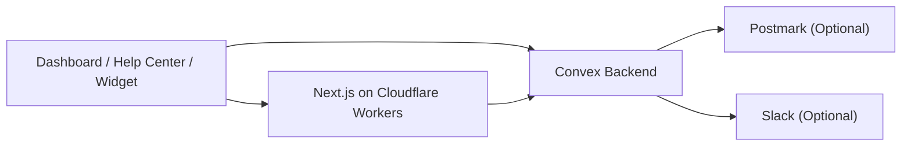

# Open Helpdesk

> Open-source support desk on Convex + Cloudflare Workers.

Open Helpdesk gives you a self-hosted support inbox, public help center, product updates feed, and embeddable widget in one repo. It is designed to boot from a fresh install with a first-owner setup flow, and it keeps Postmark and Slack optional so a basic deployment stays simple.

[](https://deploy.workers.cloudflare.com/?url=https://github.com/jamesdevonport/open-helpdesk)

Cloudflare’s official deploy-button format is documented [here](https://developers.cloudflare.com/workers/platform/deploy-buttons/). Their docs also note that deploy buttons do not fully support monorepos yet, so if the one-click import does not infer the project correctly, use the manual setup steps below.

## What You Get

- Password-based first-owner bootstrap at `/setup`
- Shared dashboard, help center, and widget deployment
- Public help articles and product updates
- Embeddable `window.OpenHelpdesk` widget with `siteUrl` support
- Convex backend with optional Postmark email replies and optional Slack routing
- Cloudflare Workers deployment path via OpenNext

## Architecture



## Quickstart

```bash
cp .env.example .env.local
npm install
npm run check:setup
```

Start Convex in one terminal:

```bash
npm run dev:convex
```

Start the app in another:

```bash
npm run dev
```

Then open [http://localhost:3000/setup](http://localhost:3000/setup), create the first owner account, and finish workspace bootstrap.

## Setup Process

### 1. Create a Convex deployment

You need a Convex project before the dashboard can boot.

1. Create or log into your Convex account.
2. Create a deployment for this project.
3. Copy the deployment URLs:
   - `NEXT_PUBLIC_CONVEX_URL`: your public `.convex.cloud` URL
   - `CONVEX_SITE_URL`: your `.convex.site` URL for webhooks

### 2. Fill the core variables

Copy `.env.example` to `.env.local`, then uncomment and set:

```bash
NEXT_PUBLIC_CONVEX_URL=https://your-deployment.convex.cloud
CONVEX_SITE_URL=https://your-deployment.convex.site
SITE_URL=https://support.example.com
```

What each one does:

- `NEXT_PUBLIC_CONVEX_URL` is used by the dashboard and widget client
- `CONVEX_SITE_URL` is used for inbound webhook endpoints like Postmark
- `SITE_URL` is your public support hostname and the URL the widget links back to

### 3. Boot the workspace

1. Run `npm install`
2. Run `npm run dev:convex`
3. Run `npm run dev`
4. Open `http://localhost:3000/setup`
5. Create the first owner account with email + password
6. Enter the workspace name and complete bootstrap

After that:

- `/setup` is effectively closed
- normal dashboard sign-in uses email + password
- additional team members should be added from the dashboard, not by reopening bootstrap

### 4. Optional keys

You do not need these for the basic product to work.

Optional Postmark keys:

- `POSTMARK_SERVER_TOKEN`
- `POSTMARK_INBOUND_ADDRESS`
- `POSTMARK_WEBHOOK_SECRET`
- `DEFAULT_FROM_EMAIL`
- `INBOUND_ORG_ID`

Optional Slack keys:

- `SLACK_BOT_TOKEN`
- `SLACK_CHANNEL_ID`
- `SLACK_SIGNING_SECRET`

### 5. Deploy order

The intended order is:

1. Configure Convex and deploy the backend first with `npx convex deploy --yes`
2. Deploy the frontend/worker with `npm run deploy:cloudflare`
3. Point your domain at Cloudflare
4. Set `SITE_URL` to that final public hostname
5. If you want a docs-only hostname, also set `HELP_CENTER_HOST`

### 6. Where keys live

- Local development: `.env.local`
- Cloudflare production runtime: Worker environment variables / secrets
- Convex production runtime: Convex environment variables
- GitHub Actions: repository secrets / variables if you use the included workflows

## Deploy With AI

The repo is set up so an agent can operate from the root without guessing workspace paths.

```bash
npm install
npm run check:setup
npm run build:widget
npx convex deploy --yes
npm run deploy:cloudflare
```

Expected checkpoints:

- `npm run check:setup` reports the three required core variables as configured
- `npx convex deploy --yes` completes without schema or auth errors
- `npm run deploy:cloudflare` builds via OpenNext and uploads the Worker

If you use the Cloudflare deploy button, Cloudflare will prompt for the core runtime variables from `wrangler.jsonc`. The same keys stay commented in `.env.example` so local development is documented without creating duplicate deploy-button fields.

## Environment

### Required core

| Variable | Purpose |
| --- | --- |
| `NEXT_PUBLIC_CONVEX_URL` | Public Convex client URL used by the dashboard and widget |
| `CONVEX_SITE_URL` | Convex site URL used for inbound webhooks |
| `SITE_URL` | Public URL of the support deployment |

### Optional email

| Variable | Purpose |
| --- | --- |
| `POSTMARK_SERVER_TOKEN` | Sends outbound email replies |
| `POSTMARK_INBOUND_ADDRESS` | Reply-to address for threaded email replies |
| `POSTMARK_WEBHOOK_SECRET` | Validates inbound webhook requests |
| `DEFAULT_FROM_EMAIL` | Fallback sender when org-level sender is unset |
| `INBOUND_ORG_ID` | Optional override for inbound email routing |

### Optional Slack

| Variable | Purpose |
| --- | --- |
| `SLACK_BOT_TOKEN` | Posts and syncs messages to Slack |
| `SLACK_CHANNEL_ID` | Default Slack channel for support threads |
| `SLACK_SIGNING_SECRET` | Validates inbound Slack events |

### Optional deployment automation

| Variable | Purpose |
| --- | --- |
| `CONVEX_DEPLOY_KEY` | GitHub Action secret for Convex deploys |
| `CLOUDFLARE_API_TOKEN` | GitHub Action secret for Cloudflare deploys |
| `CLOUDFLARE_ACCOUNT_ID` | Cloudflare account identifier |
| `HELP_CENTER_HOST` | Optional docs-only hostname rewrite |

## Widget Contract

The public embed contract is:

- global: `window.OpenHelpdesk`
- script: `/open-helpdesk.js`
- update markers: `data-open-helpdesk-updates`

Example embed:

```html
<script>
  window.OpenHelpdesk = {
    organizationId: "YOUR_ORG_ID",
    convexUrl: "https://your-deployment.convex.cloud",
    siteUrl: "https://support.example.com",
    color: "#1977f2",
    greeting: "Hi! How can we help?",
    position: "bottom-right"
  };
</script>
<script src="https://support.example.com/open-helpdesk.js" defer></script>
```

## Deployment Guides

- [Convex deployment](docs/deploy/convex.md)
- [Cloudflare Workers deployment](docs/deploy/cloudflare.md)

## Customization

- Change widget colors, greeting, update-tab visibility, and auto-close timing in the dashboard settings
- Publish help articles and product updates from the dashboard
- Set your own sender name and sender address in Email Settings
- Point `HELP_CENTER_HOST` at a docs subdomain if you want `/help` content on a dedicated host

## Repo Layout

```text
apps/dashboard   Next.js dashboard + public help center + widget host
packages/widget  Embeddable widget bundle
convex           Backend functions, schema, auth, and webhooks
docs             Deployment and operator docs
```

## Open-Source Hygiene

- [Contributing guide](CONTRIBUTING.md)
- [Security policy](SECURITY.md)
- [Apache-2.0 license](LICENSE)
