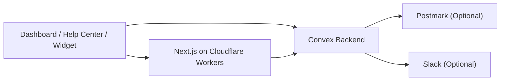

# Open Helpdesk

> Open-source support desk on Convex + Cloudflare Workers.

Open Helpdesk gives you a self-hosted support inbox, public help center, product updates feed, and embeddable widget in one repo. It is designed to boot from a fresh install with a first-owner setup flow, and it keeps Postmark and Slack optional so a basic deployment stays simple.

## What You Get

- Password-based first-owner bootstrap at `/setup`
- Shared dashboard, help center, and widget deployment
- Public help articles and product updates
- Embeddable `window.OpenHelpdesk` widget with `siteUrl` support
- Convex backend with optional Postmark email replies and optional Slack routing
- Cloudflare Workers deployment path via OpenNext

## Architecture



## Quickstart

```bash
cp .env.example .env.local
npm install
npm run check:setup
```

Start Convex in one terminal:

```bash
npm run dev:convex
```

Start the app in another:

```bash
npm run dev
```

Then open [http://localhost:3000/setup](http://localhost:3000/setup), create the first owner account, and finish workspace bootstrap.

## Deploy With AI

The repo is set up so an agent can operate from the root without guessing workspace paths.

```bash
npm install
npm run check:setup
npm run build:widget
npx convex deploy --yes
npm run deploy:cloudflare
```

Expected checkpoints:

- `npm run check:setup` reports the three required core variables as configured
- `npx convex deploy --yes` completes without schema or auth errors
- `npm run deploy:cloudflare` builds via OpenNext and uploads the Worker

## Environment

### Required core

| Variable | Purpose |
| --- | --- |
| `NEXT_PUBLIC_CONVEX_URL` | Public Convex client URL used by the dashboard and widget |
| `CONVEX_SITE_URL` | Convex site URL used for inbound webhooks |
| `SITE_URL` | Public URL of the support deployment |

### Optional email

| Variable | Purpose |
| --- | --- |
| `POSTMARK_SERVER_TOKEN` | Sends outbound email replies |
| `POSTMARK_INBOUND_ADDRESS` | Reply-to address for threaded email replies |
| `POSTMARK_WEBHOOK_SECRET` | Validates inbound webhook requests |
| `DEFAULT_FROM_EMAIL` | Fallback sender when org-level sender is unset |
| `INBOUND_ORG_ID` | Optional override for inbound email routing |

### Optional Slack

| Variable | Purpose |
| --- | --- |
| `SLACK_BOT_TOKEN` | Posts and syncs messages to Slack |
| `SLACK_CHANNEL_ID` | Default Slack channel for support threads |
| `SLACK_SIGNING_SECRET` | Validates inbound Slack events |

### Optional deployment automation

| Variable | Purpose |
| --- | --- |
| `CONVEX_DEPLOY_KEY` | GitHub Action secret for Convex deploys |
| `CLOUDFLARE_API_TOKEN` | GitHub Action secret for Cloudflare deploys |
| `CLOUDFLARE_ACCOUNT_ID` | Cloudflare account identifier |
| `HELP_CENTER_HOST` | Optional docs-only hostname rewrite |

## Widget Contract

The public embed contract is:

- global: `window.OpenHelpdesk`
- script: `/open-helpdesk.js`
- update markers: `data-open-helpdesk-updates`

Example embed:

```html
<script>
  window.OpenHelpdesk = {
    organizationId: "YOUR_ORG_ID",
    convexUrl: "https://your-deployment.convex.cloud",
    siteUrl: "https://support.example.com",
    color: "#1977f2",
    greeting: "Hi! How can we help?",
    position: "bottom-right"
  };
</script>
<script src="https://support.example.com/open-helpdesk.js" defer></script>
```

## Deployment Guides

- [Convex deployment](docs/deploy/convex.md)
- [Cloudflare Workers deployment](docs/deploy/cloudflare.md)

## Customization

- Change widget colors, greeting, update-tab visibility, and auto-close timing in the dashboard settings
- Publish help articles and product updates from the dashboard
- Set your own sender name and sender address in Email Settings
- Point `HELP_CENTER_HOST` at a docs subdomain if you want `/help` content on a dedicated host

## Repo Layout

```text
apps/dashboard   Next.js dashboard + public help center + widget host
packages/widget  Embeddable widget bundle
convex           Backend functions, schema, auth, and webhooks
docs             Deployment and operator docs
```

## Open-Source Hygiene

- [Contributing guide](CONTRIBUTING.md)
- [Security policy](SECURITY.md)
- [Apache-2.0 license](LICENSE)
